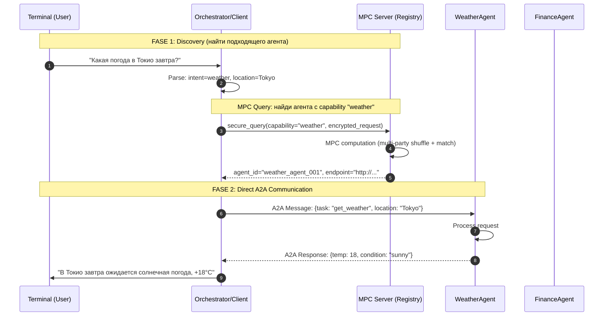

# A2A Agent Discovery через MPC Server

## Концепция

### Зачем нужен MPC Server в A2A архитектуре?

MPC (Multi-Party Computation) сервер в данном контексте играет роль **защищённого реестра/оркестратора**:

```
┌─────────────────────────────────────────────────────────────────┐
│                    MPC SERVER FUNCTIONS                          │
├─────────────────────────────────────────────────────────────────┤
│  1. AGENT REGISTRY      - Агенты регистрируются анонимно        │
│  2. CAPABILITY MATCHING - MPC позволяет найти агента без        │
│                           раскрытия ЧТО именно ищет клиент     │
│  3. SECURE ROUTING      - Запрос передаётся без посредников    │
│  4. RESULT AGGREGATION  - Агрегирует ответы от нескольких       │
│                           агентов (если нужно)                 │
└─────────────────────────────────────────────────────────────────┘
```

### Ключевое преимущество MPC:

Клиент делает запрос **"найди агента для погоды"** — но **MPC сервер не видит**:
- Какой именно запрос (запрос зашифрован/разбит на доли)
- Какие агенты доступны в системе (их список тоже разбит)

Это критично когда:
- Агенты содержат чувствительные capability-описания
- Запросы клиента не должны быть видны даже серверу
- Нужно доказательство того, что поиск был выполнен корректно

## Схема взаимодействия



## Запуск

### 1. Настройка .env
```bash
cp .env.example .env
# Заполните API_KEY в .env
```

### 2. Создание виртуального окружения и установка зависимостей
```bash
python3 -m venv .venv
source .venv/bin/activate 
pip install -r requirements.txt
```

### 2. Запуск MPC Server
```bash
source .venv/bin/activate
python mpc_server.py
```

### 3. Запуск агентов (в отдельных терминалах)
```bash
source .venv/bin/activate
python agents/weather_agent.py
python agents/finance_agent.py
```

### 4. Запуск клиента
```bash
source .venv/bin/activate
python client.py
```

### Пример сессии
```
> Введите запрос: Какая погода в Токио завтра в 15:00?
> Поиск агента через MPC сервер...
> Найден агент: weather_agent_001
> Ответ: В Токио завтра ожидается солнечная погода, +18°C
```
