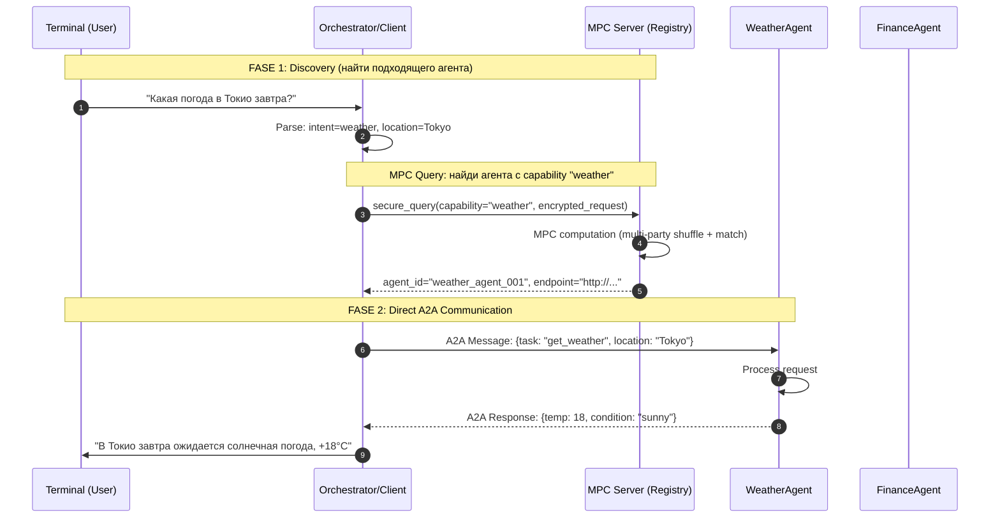

# A2A Agent Discovery через MPC Server

## Концепция

### Зачем нужен MPC Server в A2A архитектуре?

MPC (Multi-Party Computation) сервер в данном контексте играет роль **защищённого реестра/оркестратора**:

```
┌─────────────────────────────────────────────────────────────────┐
│                    MPC SERVER FUNCTIONS                          │
├─────────────────────────────────────────────────────────────────┤
│  1. AGENT REGISTRY      - Агенты регистрируются анонимно        │
│  2. CAPABILITY MATCHING - MPC позволяет найти агента без        │
│                           раскрытия ЧТО именно ищет клиент     │
│  3. SECURE ROUTING      - Запрос передаётся без посредников    │
│  4. RESULT AGGREGATION  - Агрегирует ответы от нескольких       │
│                           агентов (если нужно)                 │
└─────────────────────────────────────────────────────────────────┘
```

### Ключевое преимущество MPC:

Клиент делает запрос **"найди агента для погоды"** — но **MPC сервер не видит**:
- Какой именно запрос (запрос зашифрован/разбит на доли)
- Какие агенты доступны в системе (их список тоже разбит)

Это критично когда:
- Агенты содержат чувствительные capability-описания
- Запросы клиента не должны быть видны даже серверу
- Нужно доказательство того, что поиск был выполнен корректно

## Доступные агенты

### Weather Agent (порт 9001)
**Capabilities:** weather, temperature, forecast, погода, температура

**Задачи:**
| Задача | Параметры | Описание |
|--------|-----------|----------|
| `get_weather` | `location` | Текущая погода в городе |
| `get_forecast` | `location` | Прогноз на 3 дня |

### Finance Agent (порт 9002)
**Capabilities:** stock, finance, market, акции, финансы, price

**Задачи:**
| Задача | Параметры | Описание |
|--------|-----------|----------|
| `get_quote` | `symbol` | Котировка акции (AAPL, GOOGL, MSFT, TSLA, AMZN) |
| `get_market_summary` | — | Сводка по всем акциям |

## Схема взаимодействия



## Запуск

### 1. Настройка .env
```bash
cp .env.example .env
# Заполните API_KEY в .env
```

### 2. Создание виртуального окружения
```bash
python3 -m venv .venv
source .venv/bin/activate 
pip install -r requirements.txt
```

### 3. Запуск сервисов (в отдельных терминалах)

```bash
# Терминал 1: MPC Server
python mpc_server.py

# Терминал 2: Weather Agent
python agents/weather_agent.py

# Терминал 3: Finance Agent
python agents/finance_agent.py

# Терминал 4: Client
python client.py
```

## Примеры запросов

```
> Какая погода в Токио?
>>> Погода в Tokyo: cloudy, 18°C, влажность 65%

> Курс акций AAPL
>>> AAPL: $172.45 (+1.23, +0.72%)

> Покажи прогноз для Лондона
>>> Погода в London: sunny, 22°C, влажность 45%

> Какие акции есть на рынке?
>>> MSFT: $378.50, TSLA: $248.30, GOOGL: $138.75...
```

## Структура проекта

```
agent_example/
├── README.md              # Документация
├── requirements.txt       # Зависимости
├── .env                   # API ключи (не коммитится)
├── .env.example           # Пример .env
├── models.py              # Общие модели данных
├── llm.py                  # LLM клиент для парсинга
├── mpc_server.py          # MPC сервер (реестр агентов)
├── client.py              # Orchestrator/терминальный клиент
└── agents/
    ├── __init__.py
    ├── weather_agent.py    # Weather Agent
    └── finance_agent.py    # Finance Agent
```
