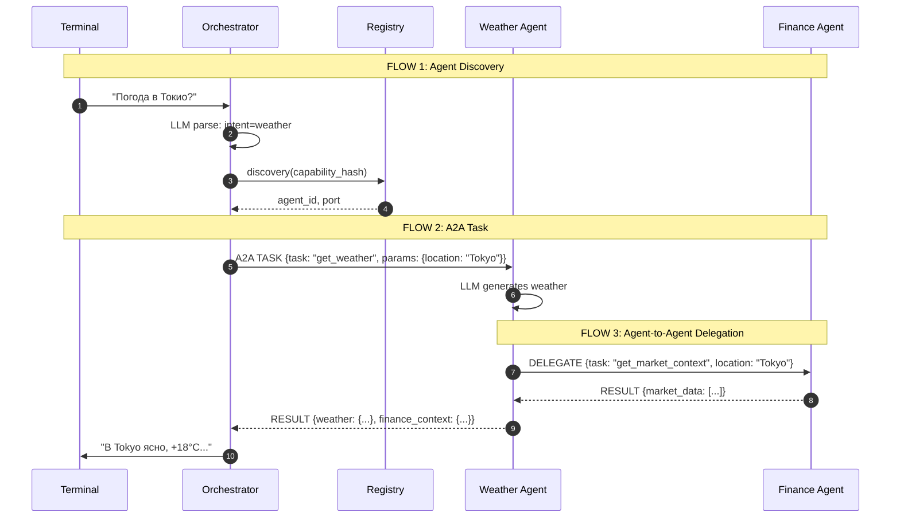

# A2A Agent System с MPC Discovery

## Концепция

### Что такое A2A?

A2A (Agent-to-Agent) — протокол коммуникации между агентами, где агенты могут:
- Общаться напрямую друг с другом
- Делегировать задачи другим агентам
- Возвращать результаты запрашивающему агенту

### Роль Registry (MPC-like)

Registry играет роль **защищённого реестра** с MPC-подобным функционалом:
- Агенты регистрируются анонимно
- Discovery по хешированным capabilities (сервер не знает что ищет клиент)
- Agents общаются напрямую после discovery

## A2A Протокол

### Message Envelope

```json
{
    "message_id": "uuid",
    "version": "1.0",
    "msg_type": "task|result|error|delegate|capabilities_request",
    "from": "weather_agent",
    "to": "finance_agent",
    "body": { "task": "...", "params": {...} },
    "correlation_id": "uuid",
    "timestamp": "ISO8601",
    "reply_to": "orchestrator"
}
```

### Message Types

| Type | Описание |
|------|----------|
| `TASK` | Задача для выполнения |
| `RESULT` | Результат выполнения |
| `ERROR` | Ошибка |
| `DELEGATE` | Делегирование задачи |
| `CAPABILITIES_REQUEST` | Запрос capabilities агента |
| `HEARTBEAT` | Проверка доступности |

## Архитектура

```
┌──────────────────────────────────────────────────────────────────┐
│                           TERMINAL                                │
└─────────────────────────────┬────────────────────────────────────┘
                              │
                              ▼
┌──────────────────────────────────────────────────────────────────┐
│                    ORCHESTRATOR / CLIENT                          │
│  ┌──────────────┐  ┌─────────────────┐  ┌────────────────────┐  │
│  │  LLM Parser │  │  Discovery      │  │ Response Formatter │  │
│  │  (.env API) │  │  Client        │  │                    │  │
│  └──────────────┘  └─────────────────┘  └────────────────────┘  │
└─────────────────────────────┬────────────────────────────────────┘
                              │
              ┌───────────────┼───────────────┐
              ▼               ▼               ▼
┌──────────────────┐ ┌──────────────────┐ ┌──────────────────┐
│   REGISTRY       │ │  Weather Agent   │ │  Finance Agent   │
│   (port 9000)    │ │   (port 9001)   │ │   (port 9002)   │
│                  │ │                  │ │                  │
│  - Registration │ │  - A2A Server   │ │  - A2A Server   │
│  - Discovery    │ │  - LLM (GPT)    │ │  - LLM (GPT)    │
│  - MPC matching │ │  - Delegation   │ │  - Delegation   │
└──────────────────┘ └──────────────────┘ └──────────────────┘
```

## Доступные агенты

### Weather Agent (port 9001)
- **Capabilities:** weather, temperature, forecast, погода
- **Задачи:** `get_weather`, `get_forecast`
- **LLM:** Генерирует реалистичные прогнозы

### Finance Agent (port 9002)
- **Capabilities:** stock, finance, market, акции, финансы
- **Задачи:** `get_quote`, `get_market_summary`, `get_market_context`
- **LLM:** Генерирует реалистичные котировки

## A2A Flow



## Запуск

### 1. Настройка .env
```bash
cp .env.example .env
# Заполните API_KEY
```

### 2. Установка зависимостей
```bash
python3 -m venv .venv
source .venv/bin/activate
pip install -r requirements.txt
```

### 3. Запуск сервисов

```bash
# Терминал 1: Registry Server
python a2a_server.py

# Терминал 2: Weather Agent
python agents/weather_agent.py

# Терминал 3: Finance Agent
python agents/finance_agent.py

# Терминал 4: Client
python client.py
```

## Примеры запросов

```
> Погода в Новосибирске
>>> В Новосибирске ожидается переменная облачность, возможен небольшой снег.
>>> Температура около -5°C, влажность 75%.

> Курс акций AAPL
>>> Apple показывает рост на фоне позитивных новостей.
>>> AAPL: $178.50 (+2.35, +1.33%)
```

## Структура проекта

```
agent_example/
├── README.md              # Документация
├── requirements.txt       # Зависимости
├── .env                   # API ключи
├── .env.example           # Пример .env
├── models.py              # A2A Protocol models
├── llm.py                 # LLM клиент для парсинга
├── a2a_server.py          # A2A Server + Registry
├── client.py              # A2A Orchestrator/Client
└── agents/
    ├── __init__.py
    ├── base_agent.py      # BaseA2AAgent с delegation
    ├── weather_agent.py   # Weather Agent
    └── finance_agent.py   # Finance Agent
```

## A2A Agent-to-Agent коммуникация

Агенты могут делегировать задачи друг другу:

```python
# Weather Agent может запросить данные у Finance Agent
result = await self.delegate_task(
    "finance_agent",
    "get_market_context",
    {"location": location},
    context={"source": "weather_agent"}
)
```

Это позволяет создавать сложные сценарии где несколько агентов работают together.
