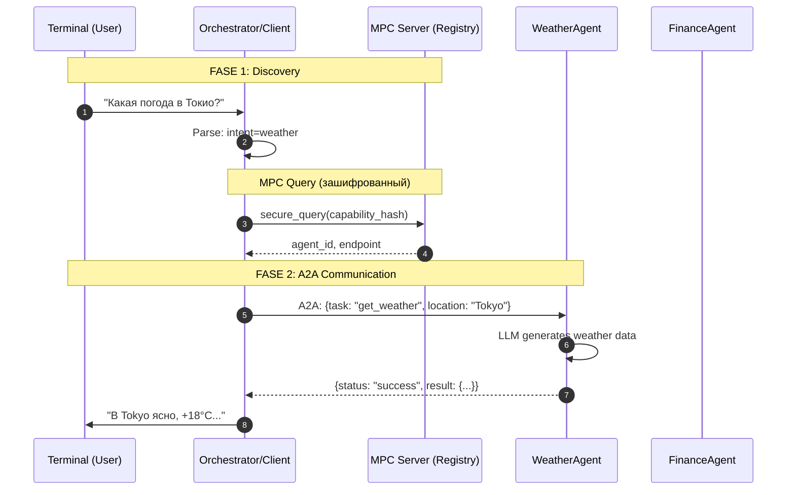

# A2A Agent Discovery через MPC Server

## Концепция

### Зачем нужен MPC Server в A2A архитектуре?

MPC (Multi-Party Computation) сервер в данном контексте играет роль **защищённого реестра/оркестратора**:

```
┌─────────────────────────────────────────────────────────────────┐
│                    MPC SERVER FUNCTIONS                          │
├─────────────────────────────────────────────────────────────────┤
│  1. AGENT REGISTRY      - Агенты регистрируются анонимно        │
│  2. CAPABILITY MATCHING - MPC позволяет найти агента без        │
│                           раскрытия ЧТО именно ищет клиент     │
│  3. SECURE ROUTING      - Запрос передаётся без посредников  │
│  4. RESULT AGGREGATION  - Агрегирует ответы от нескольких     │
│                           агентов (если нужно)                 │
└─────────────────────────────────────────────────────────────────┘
```

### Ключевое преимущество MPC:

Клиент делает запрос **"найди агента для погоды"** — но **MPC сервер не видит**:
- Какой именно запрос (запрос зашифрован/разбит на доли)
- Какие агенты доступны в системе (их список тоже разбит)

### Архитектура с LLM

```
┌──────────────────────────────────────────────────────────────────┐
│                           TERMINAL                                │
└─────────────────────────────┬────────────────────────────────────┘
                              │
                              ▼
┌──────────────────────────────────────────────────────────────────┐
│                    ORCHESTRATOR / CLIENT                          │
│  ┌──────────────┐  ┌─────────────────┐  ┌────────────────────┐  │
│  │  LLM Parser  │  │  MPC Discovery  │  │ Response Formatter │  │
│  │  (из .env)   │  │     Client      │  │                    │  │
│  └──────────────┘  └─────────────────┘  └────────────────────┘  │
└─────────────────────────────┬────────────────────────────────────┘
                              │
              ┌───────────────┼───────────────┐
              ▼               ▼               ▼
┌──────────────────┐ ┌──────────────────┐ ┌──────────────────┐
│   MPC SERVER     │ │  Weather Agent   │ │  Finance Agent   │
│   (Registry)     │ │   (port 9001)   │ │   (port 9002)   │
│   (port 9000)   │ │  + LLM (GPT)    │ │  + LLM (GPT)    │
└──────────────────┘ └──────────────────┘ └──────────────────┘
```

## Доступные агенты

### Weather Agent (порт 9001)
**Capabilities:** weather, temperature, forecast, погода, температура

**LLM:** Генерирует реалистичные прогнозы погоды

**Задачи:**
| Задача | Параметры | Описание |
|--------|-----------|----------|
| `get_weather` | `location` | Текущая погода в городе |
| `get_forecast` | `location` | Прогноз на 3 дня |

### Finance Agent (порт 9002)
**Capabilities:** stock, finance, market, акции, финансы, price

**LLM:** Генерирует реалистичные котировки акций

**Задачи:**
| Задача | Параметры | Описание |
|--------|-----------|----------|
| `get_quote` | `symbol` | Котировка акции (AAPL, GOOGL, MSFT, TSLA, AMZN) |
| `get_market_summary` | — | Сводка по всем акциям |

## Схема взаимодействия



## Запуск

### 1. Настройка .env
```bash
cp .env.example .env
# Заполните API_KEY в .env
```

### 2. Создание виртуального окружения
```bash
python3 -m venv .venv
source .venv/bin/activate 
pip install -r requirements.txt
```

### 3. Запуск сервисов (в отдельных терминалах)

```bash
# Терминал 1: MPC Server
python mpc_server.py

# Терминал 2: Weather Agent
python agents/weather_agent.py

# Терминал 3: Finance Agent
python agents/finance_agent.py

# Терминал 4: Client
python client.py
```

## Примеры запросов

```
> Погода в Новосибирске
>>> В Новосибирске ожидается переменная облачность, возможен небольшой снег.
>>> Температура около -5°C, влажность 75%.

> Курс акций AAPL
>>> Apple показывает рост на фоне позитивного квартального отчёта.
>>> AAPL: $178.50 (+2.35, +1.33%)

> Прогноз для Лондона на завтра
>>> Завтра в Лондоне ожидается дождливая погода.
>>> Температура 12°C, влажность 85%.

> Рыночная сводка
>>> Обзор рынка: технологический сектор показывает рост.
>>> AAPL: $178.50 (+2.35), GOOGL: $142.30 (+1.85), MSFT: $380.20 (+3.10)...
```

## Структура проекта

```
agent_example/
├── README.md              # Документация
├── requirements.txt       # Зависимости
├── .env                   # API ключи (не коммитится)
├── .env.example           # Пример .env
├── models.py              # Общие модели данных
├── llm.py                 # LLM клиент для парсинга
├── mpc_server.py          # MPC сервер (реестр агентов)
├── client.py              # Orchestrator/терминальный клиент
└── agents/
    ├── __init__.py
    ├── base_agent.py      # Базовый класс с LLM интеграцией
    ├── weather_agent.py    # Weather Agent (LLM-powered)
    └── finance_agent.py    # Finance Agent (LLM-powered)
```

## Конфигурация .env

```bash
API_KEY=
BASE_URL=
LLM_NAME=
```

**Важно:** API_KEY используется для:
1. LLM-парсинга запросов в Orchestrator
2. Генерации данных в агентах (Weather, Finance)
